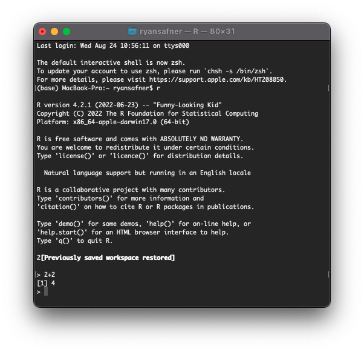
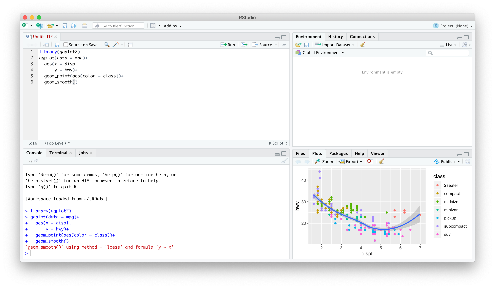
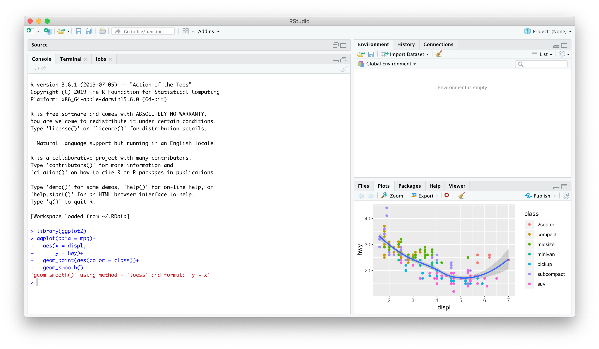
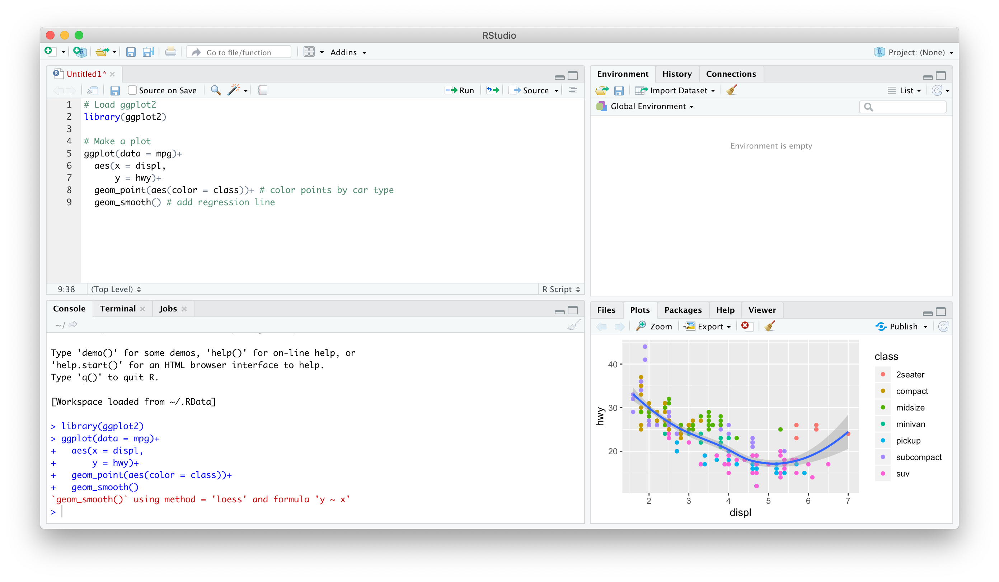

# Agenda

## 5 Important verbs for handling data

### `View`, `glimpse`, `structure`, `head`, `tail`

### `select()` for column selection

### `filter()` for data filtering

### `arrange()` Data Ordering

### `mutate()` Creating Derived Columns

### `summarise()` Calculating Summary Statistics

### `group_by()`

```{r}
#| label: setup
#| include: false
library(tidyverse)
library(kableExtra)
library(patchwork)
library(fontawesome)
library(gapminder)
library(scales)
```

## Data Science

-   [You go into data analysis with the tools you know, not the tools you need]{.hi}

-   The next couple of days are all about giving you the tools you need

    -   Admittedly, a bit before you know what you need them *for*

-   We will extend them as we learn specific models

## R

::: columns
::: {.column width="50%"}
-   **Free** and **open source**

-   A very large community

    -   Written by statisticians for statistics
    -   Most packages are written for `R` first

-   Can handle virtually any data format

-   Makes replication easy

-   Can integrate into documents (with `R markdown`)

-   R is a *language* so it can do *everything*

    -   A good stepping stone to learning other languages like *Python*
:::

::: {.column width="50%"}

:::
:::

## Excel (or Stata) Can't Do This

::: panel-tabset
## Code

```{r}
#| echo: true
#| eval: false
ggplot(data = gapminder, 
       aes(x = gdpPercap,
           y = lifeExp,
           color = continent))+
  geom_point(alpha=0.3)+
  geom_smooth(method = "lm")+
	scale_x_log10(breaks=c(1000,10000, 100000),
	              label=scales::dollar)+
	labs(x = "GDP/Capita",
	     y = "Life Expectancy (Years)")+
  facet_wrap(~continent)+
  guides(color = F)+
  theme_light()
```

## Output

```{r}
#| echo: false
#| eval: true
ggplot(data = gapminder, 
       aes(x = gdpPercap,
           y = lifeExp,
           color = continent))+
  geom_point(alpha=0.3)+
  geom_smooth(method = "lm")+
	scale_x_log10(breaks=c(1000,10000, 100000),
	              label=scales::dollar)+
	labs(x = "GDP/Capita",
	     y = "Life Expectancy (Years)")+
  facet_wrap(~continent)+
  guides(color = F)+
  theme_light()
```
:::

## Or This

::: panel-tabset
### Input

The average GDP per capita is `` ` r dollar(mean(gapminder$gdpPercap)) ` `` with a standard deviation of `` ` r dollar(sd(gapminder$gdpPercap)) ` ``.

### Output

The average GDP per capita is `r dollar(mean(gapminder$gdpPercap))` with a standard deviation of `r dollar(sd(gapminder$gdpPercap))`.
:::

## Or This

```{r}
#| echo: true
#| fig-width: 18
#| fig-align: center
library(leaflet)
leaflet() %>%
  addTiles() %>%
  addMarkers(lng = 73.136946, lat =33.748294 ,
             popup = "School of Economics, QAU, Islamabad")
```

# Meet R and R Studio {.centered background-color="#314f4f"}

## R and R Studio

::: columns
::: {.column width="50%"}
-   [R]{.hi} is the programming language that executes commands

-   Could run this from your computer's shell

    -   On Windows: **Command prompt**
    -   On Mac/Linux: **Terminal**
:::

::: {.column width="50%"}

:::
:::

## R and R Studio

::: columns
::: {.column width="50%"}
-   [R Studio]{.hi-purple}[^1] is an **integrated development environment** (IDE) that makes your coding life a lot easier
    -   Write code in scripts
    -   Execute individual commands & scripts
    -   Auto-complete, highlight syntax
    -   View data, objects, and plots
    -   Get help and documentation on commands and functions
    -   Integrate code into documents with `Quarto`
:::

::: {.column width="50%"}

:::
:::

[^1]: The company R Studio recently [announced](https://www.rstudio.com/blog/rstudio-is-becoming-posit/) they will be rebranding later this fall as **Posit**.

## R Studio --- Four Panes

{fig-align="center"}

## Ways to Use R Studio: Using the Console

::: columns
::: {.column width="50%"}
-   Type individual commands into the console pane (bottom left)

-   Great for testing individual commands to see what happens

-   Not saved! Not reproducible! Not recommended!
:::

::: {.column width="50%"}

:::
:::

## Ways to Use R Studio: Writing a `.R` Script

::: columns
::: {.column width="50%"}
-   Source pane is a text-editor

-   Make `.R` files: all input commands in a single script

-   Comment with `#`

-   Can run any or all of script at once

-   Can save, reproduce, and send to others!
:::

::: {.column width="50%"}

:::
:::

## 

I have discussed the [Gapminder dataset](https://cran.r-project.org/web/packages/gapminder/index.html) in my videos and we shall use it as a reference for this training. It's available through CRAN, so make sure to install it. Here's how to load in all required packages:

```{r , warning=FALSE,message=FALSE}
#| echo: false
library(tidyverse)
library(knitr)
library(kableExtra)
#install.packages("gapminder")
library(hrbrthemes)
library(viridis)
library(kableExtra)
options(knitr.table.format = "html")
library(plotly)
library(gridExtra)
library(ggrepel)

```

## The dataset is provided in the `gapminder` library

```{r}
library(gapminder)

gapminder %>% filter(country=="Sweden")%>%
  mutate(gdpPercap=round(gdpPercap,0), lifeExp=round(lifeExp,2))%>%kable()%>%
  kable_styling(bootstrap_options = "striped", full_width = F)

```

## Information in **gapminder** data

`View` command opens data in new worksheet while glimpse lists nature of variables (numeric/character/factor...) and total number of rows and columns.

```{r data-structure, comment= ""}
glimpse(gapminder) # We see that there are 1704 rows for 6 columns and also tells nature of variable
#View(gapminder)    # This opens up full data in a new window
```

## Filtering with respect to two variables

### One can apply multiple `filters`

```{r}
gapminder %>% filter(year==2007,country=="Sri Lanka")

gapminder %>% filter(year==2007, country=="Pakistan")

```

### Now we are selecting multiple countries for year 2007.

```{r}
gapminder %>% filter(year==2007, country %in% c("India", "Pakistan","Bangladesh", "Afghanistan", "Iran"))
```

## Filtering data for South Asia countries

```{r}
gapminderSA<-gapminder %>% filter(country %in% c("Bangladesh","India","Pakistan","Sri Lanka","Nepal", "Afghanistan","Bhutan", "Maldives"))
gapminderSA
```

## Sort data with `arrange()`

```{r}
gapminderSA %>% arrange(gdpPercap)

```

\##

Note that by default `arrange()` sorts in ascending order. If we want to sort in descending order, we use the function `desc()`.

```{r}
gapminderSA %>% arrange(desc(gdpPercap))
```

## Life Expectancy in South Asia in 2007

What is the lowest and highest life expectancy among South Asian countries?

```{r}
gapminderSA %>% filter(year==2007) %>%  arrange(lifeExp)
```

## What was it in 1952? {.scroll}

`mutate()` to change existing or create new variable

```{r}
gapminderSA %>% mutate(pop=pop/1000000)
```

If we want to calculate GDP, we need to multiply gdpPercap by pop.

But wait! Didn't we just change pop so it's expressed in millions? No: we never stored the results of our previous command, we simply displayed them. Just as I discussed above, unless you overwrite it, the original gapminder dataset will be unchanged. With this in mind, we can create the gdp variable as follows:

```{r}
gapminderSA %>% mutate(gdp = pop * gdpPercap)
```

## How to calculate new variables

As mentioned above, `mutate` is used to calculate new variable. Here we have calculated a new variable `gdp` and then `arrange()` data and selected `top_n(10)` countries to see whether higher `lifeExpectancy` and higher `gdp` are linked or not?

```{r top-10}
gapminder %>% filter(year==2007) %>% 
  mutate(gdp=gdpPercap*pop) %>% 
  arrange(desc(gdp)) %>% 
  top_n(10)

```

## 

`transmute()` keeps only the derived column. Let's use it in the example from above:

```{r }
gapminder %>% filter(year==2007) %>% 
  transmute(gdp=gdpPercap*pop) %>% 
  arrange(desc(gdp)) %>% 
  top_n(10)

```

## Ordering

arrange data by life expectancy, we use `arrange()` function

```{r}
gapminder %>% 
  select(country, year,lifeExp) %>% 
  filter(year==2007) %>% 
  arrange(lifeExp)

```

## 

top to bottom, then use `arrange(desc())` command as follows:

```{r}
gapminder %>% 
  select(country, year,lifeExp) %>% 
  filter(year==2007) %>% 
  arrange(desc(lifeExp))

```

### Top 5

```{r}
gapminder %>% 
  select(country, year,lifeExp) %>% 
  filter(year==2007) %>% 
  arrange(desc(lifeExp)) %>% 
  top_n(5)

```

## Summarising data

Another feature of dplyr is `summarise` data

```{r}
gapminder %>% filter(year==2007) %>% group_by(continent) %>% summarise(mean=mean(lifeExp),min=min(lifeExp),max=max(lifeExp))
```

## 

```{r}
gapminder %>% 
  summarise(avglifeExp=mean(lifeExp))

```

## Summarising data by groups

```{r}
gapminder %>%
  filter(year == 2007, continent == "Asia") %>%
  summarize(avgLifeExp = mean(lifeExp)) 

```

## 

```{r}
gapminder %>% 
  group_by(continent) %>% 
  filter(year==2007) %>% 
  summarize(avglife=mean(lifeExp))

```

## 

we could get the mean, maximum, and mean life expectancy of the entire dataset.

```{r}
gapminder %>%
  summarise(
    lifeExp_min = min(lifeExp),
    lifeExp_max = max(lifeExp),
    lifeExp_mean = mean(lifeExp)
  )
```

## 

For example, let's say we want to get the mean, minimum, and maximum of life expectancy, but instead of for the entire dataset, we want to see it for each year.

```{r}
gapminder %>%
  group_by(year) %>%
  summarise(
    lifeExp_min = min(lifeExp),
    lifeExp_max = max(lifeExp),
    lifeExp_mean = mean(lifeExp)
  )

```

## [dplyr tutorial0](https://anderfernandez.com/en/blog/dplyr-tutorial/)

`if_else` command alongwith mutate

```{r}
gapminder %>%
  filter(year == 2007) %>%
  group_by(continent) %>%
  summarize(avgLifeExp = mean(lifeExp)) %>%
  mutate(over75 = if_else(avgLifeExp > 70, "Y", "N"))

```

## Total Population by Continents in 2007

```{r}
gapminder %>% 
  filter(year==2007) %>% 
  group_by(continent) %>% 
  summarize(tot_pop=sum(pop)) 

```

## Percentiles

In general it is assumed that higher the GDP , higher the lifeExp. To test this assumption, lets calculate percentiles of lifeExp. This will indicate how many countries have ranking lower than the current country.

```{r}
gapminder %>% select(country,year, lifeExp, gdpPercap) %>% 
  filter(year == 2007) %>%
  mutate(percentile = ntile(lifeExp, 100)) %>%
  arrange(desc(gdpPercap))
```

## 

One can notice that all countries are well above 60th percentile on lifeExpectancy when arranged by GDP per capita.

Before you conclude, lets see the bottom side

So it makes sense that higher the GDP, higher the lifeExp. This is not formal testing but exploratory data makes lot of sense here.

```{r}
gapminder %>% select(country,year, lifeExp, gdpPercap) %>% 
  filter(year == 2007) %>%
  mutate(percentile = ntile(lifeExp, 100)) %>%
  arrange(gdpPercap)
```

## Advanced Analysis

Filtering data as done in introductory analysis seems quite difficult if you are not familiar with these simple things. But if you are working with dplyr for quite sometime, there is not anything very advanced or difficult.

For example, let's say you have to find out the top 10 countries in the 90th percentile regarding life expectancy in 2007. You can reuse some of the logic from the previous sections, but answering this question alone requires `multiple filtering` and `subsetting`:

```{r}
gapminder %>% filter(year==2007) %>% 
  mutate(percentile=ntile(lifeExp,100)) %>% 
  filter(percentile>90) %>% 
  arrange(desc(percentile)) %>% 
  top_n(10,wt=percentile) %>% 
  select(country,continent,lifeExp,gdpPercap)

```

## 

In case you are interested in bottom 10 (worst lifeExp countries from the bottom), use `top_n` with `-10`.

```{r}
gapminder %>% filter(year==2007) %>% 
  mutate(percentile=ntile(lifeExp,100)) %>% 
  filter(percentile<10) %>% 
  arrange(percentile) %>% 
  top_n(-10,wt=percentile) %>% 
  select(country,continent,lifeExp,gdpPercap)


```

## Visualizing data to get data insight

Visualizing data is one of the most important aspect of getting data insight and may provide a better data insight than a complicated model. Visualizing large data sets were not an easy task, so researchers relied on mathematical and core econometric/regression models. `ggplot2` which is a set of `tidyverse` package is probably one of the greatest tool for data visualization used in `R`. In the following sections we are going to visualize `gapminder` data.

Stat graphics is a mapping of variable to `aes`thetic attributes of `geom`etric objects.

## 3 Essential components of `ggplot2`

-   data: dataset containing the variables of interest
-   geom: geometric object in question line, point, bars
-   aes: aesthetic attributes of an object x/y position, colors, shape, size

## Scatter plot

```{r}

gapminder2007<-gapminder %>% filter(year==2007)
p1<-ggplot(data=gapminder2007,mapping = aes(x=gdpPercap,y=lifeExp,color=continent,size=pop))+geom_point()
p1+facet_wrap(~continent)
p1+  labs(x = "GDP Per Capita", y = "Life Expectancy in Years",
          title = "Economic Growth and Life Expectancy",
          subtitle = "Data points are country-years",
          caption = "Source: Gapminder.")

```

## Bubbleplot

```{r echo=FALSE, warning=FALSE,message=FALSE}
# Show a bubbleplot

data <- gapminder %>% filter(year=="2007") %>% select(-year)

data %>%
  mutate(pop=pop/1000000) %>%
  arrange(desc(pop)) %>%
  mutate(country = factor(country, country)) %>%
  ggplot( aes(x=gdpPercap, y=lifeExp, size = pop, color = continent)) +
  geom_point(alpha=0.7) +
  scale_size(range = c(1.4, 19), name="Population (M)") +
  scale_color_viridis(discrete=TRUE, guide=FALSE) +
  theme_ipsum() +
  theme(legend.position="bottom")
```

## 

If you just want to highlight the relationship between gbp per capita and life Expectancy you've probably done most of the work now. However, it is a good practice to highlight a few interesting dots in this chart to give more insight to the plot:

```{r echo=FALSE,warning=FALSE}
# Prepare data
tmp <- data %>%
  mutate(
    annotation = case_when(
      gdpPercap > 5000 & lifeExp < 60 ~ "yes",
      lifeExp < 30 ~ "yes",
      gdpPercap > 40000 ~ "yes"
    )
  ) %>%
  mutate(pop=pop/1000000) %>%
  arrange(desc(pop)) %>%
  mutate(country = factor(country, country))

# Plot
ggplot( tmp, aes(x=gdpPercap, y=lifeExp, size = pop, color = continent)) +
  geom_point(alpha=0.7) +
  scale_size(range = c(1.4, 19), name="Population (M)") +
  scale_color_viridis(discrete=TRUE) +
  theme_ipsum() +
  theme(legend.position="none") +
  geom_text_repel(data=tmp %>% filter(annotation=="yes"), aes(label=country), size=4 )
```

```{r}
##This is a table of data about a large number of countries, each observed over several years. Let's make a scatterplot with it.
P<-ggplot(data=gapminder,mapping = aes(x=gdpPercap,y=lifeExp))  

P+geom_point()+geom_smooth()

P+geom_point()+geom_smooth(method = "lm")

P+geom_point()+geom_smooth(method = "gam")+scale_x_log10()


P+geom_point()+geom_smooth(method = "gam")+scale_x_log10(labels=scales::dollar)


P<-ggplot(data=gapminder,mapping = aes(gdpPercap,y=lifeExp,color="purple"))
P+geom_point()+geom_smooth(method = "loess")+scale_x_log10()
```

## 

```{r echo=FALSE,warning=FALSE}
##aes() is for variables
P<-ggplot(data=gapminder,mapping = aes(gdpPercap,y=lifeExp))
P+geom_point(color="purple")+geom_smooth(method = "loess")+scale_x_log10()

P<-ggplot(data=gapminder,aes(x=gdpPercap,y=lifeExp))
P+geom_point(alpha=0.3)+
  geom_smooth(color="orange",se=FALSE,size=8,method = "lm")+
  scale_x_log10()
```

## With proper title

```{r}
P<-ggplot(data=gapminder,mapping = aes(gdpPercap,y=lifeExp))
P+geom_point(alpha=0.3)+
  geom_smooth(method = "gam")+
  scale_x_log10(labels=scales::dollar)+
  labs(x = "GDP Per Capita", y = "Life Expectancy in Years",
       title = "Economic Growth and Life Expectancy",
       subtitle = "Data points are country-years",
       caption = "Source: Gapminder.")

```

```{r echo=FALSE,warning=FALSE}
##Continent wise

p <- ggplot(data = gapminder,
            mapping = aes(x = gdpPercap,
                          y = lifeExp,
                          color = continent))
p + geom_point() +
  geom_smooth(method = "loess") +
  scale_x_log10()
```

## 

```{r echo=FALSE,warning=FALSE}
p <- ggplot(data = gapminder,
            mapping = aes(x = gdpPercap,
                          y = lifeExp,
                          color = continent,
                          fill = continent))
p + geom_point() +
  geom_smooth(method = "loess") +
  scale_x_log10()
```

## 

```{r echo=FALSE,warning=FALSE}
##Aesthetics can be mapped per geom
p <- ggplot(data = gapminder, mapping = aes(x = gdpPercap, y = lifeExp))
p + geom_point(mapping = aes(color = continent)) +
  geom_smooth(method = "loess") +
  scale_x_log10()
```

## 

```{r}
p + geom_point(mapping = aes(color = log(pop))) +
scale_x_log10()  


```

## Comparison of 2007 vs 1952 continentwise

```{r echo=FALSE,warning=FALSE}
gapminder2007<-gapminder %>% filter(year==2007)
p1<-ggplot(data=gapminder2007,mapping = aes(x=gdpPercap,y=lifeExp,color=continent,size=pop))+geom_point()
cont_2007<-p1+facet_wrap(~continent)+ylim(0,90)  

gapminder1952<-gapminder %>% filter(year==1952)
p11<-ggplot(data=gapminder1952,mapping = aes(x=gdpPercap,y=lifeExp,color=continent,size=pop))+geom_point()
cont_1952<-p11+facet_wrap(~continent)+ylim(0,90)
library(gridExtra)
grid.arrange(cont_1952,cont_2007,nrow=1)

```

## 

```{r}
p1+labs(x = "GDP Per Capita", y = "Life Expectancy in Years",
        title = "Economic Growth and Life Expectancy",
        subtitle = "Data points are country-years",
        caption = "Source: Gapminder.")


```

## 

```{r roslings_plot_animation, eval=F, echo=F, comment = " "}
ggplot(gapminder) +
  aes(gdpPercap, lifeExp, size = pop, color = continent) +
  aes(group = country) +
  geom_point(alpha = 0.7, show.legend = FALSE) +
  scale_size(range = c(2, 12)) +
  scale_x_log10() +
  facet_wrap(~ continent) +
  labs(x = 'GDP per capita', y = 'life expectancy') +
  labs(title = 'Year: {frame_time}') +
  gganimate::transition_time(year) +
  gganimate::ease_aes('linear')
```

## 

```{r}
gapminder %>%  
  select(-pop, -gdpPercap) %>%  
  filter(year == 2007) %>%  
  group_by(continent) %>%  
  summarise(mean_life_exp =  
              mean(lifeExp),median_life_exp=median(lifeExp)) 

```

## 

```{r}
gapminder %>%  
  select(-pop, -gdpPercap) %>%  
  filter(year == 2007) %>%  
  group_by(continent) %>%  
  summarise(median_life_exp =  
              median(lifeExp)) %>%  
  ggplot() +  
  aes(x = continent) +  
  aes(y = median_life_exp) +  
  geom_point(color = "blue", size = 3,  
             alpha = .4) +  
  scale_y_continuous(limits = c(0,85)) +  
  labs(title = "Median life expectency by continent in 2007") +  
  labs(subtitle = "Data Source: Gapminder package in R") +  
  labs(x = "") +  
  labs(y = "Median life expectancy") +  
  labs(caption = "Zahid Asghar for 'QM4SSH'") +  
  theme_minimal()
```

## 

```{r}
    gapminder %>%  
      filter(year == 1997) %>%  
      select(country, continent, lifeExp) %>%  
      mutate(  
        life_cats =  
          case_when(lifeExp >= 70 ~ "70+",  
                    lifeExp < 70 ~ "<70")) %>%  
      ggplot() +  
      aes(x = continent, y = life_cats) +  
      geom_jitter(width = .25, height = .25)+  
      aes(col = continent) +  
      scale_color_discrete(guide = FALSE) +  
      theme_dark() +  
      labs(x = "", y = "") +  
      labs(title = "Life expectency beyond 70 in 1997")
    
```

## 

```{r}
    gapminder %>%  
      mutate(gdp_billions =  
               gdpPercap *  
               pop/1000000000) %>%  
      ggplot() +  
      aes(x = year) +  
      aes(y = gdp_billions) +  
      geom_line() +  
      aes(group = country) +  
      scale_y_log10() +  
      aes(col = continent) +  
      facet_wrap( ~ continent) +  
      scale_color_discrete(guide = F) +  
      theme_minimal()
```

## 

```{r}
    gapminder %>%  
      filter(year == 2007) %>%  
    ggplot() +  
      aes(x = continent, y = lifeExp) +  
      geom_boxplot() +  
      geom_jitter(height = 0, width = .2) +  
      stat_summary(fun.y = mean,
                   geom = "point",
                   col = "goldenrod3",
                   size = 5)
```

## Pakistan

```{r}
    gapminder %>%  
      filter(country == "Pakistan") %>%  
      ggplot() +  
      aes(x = year, y = lifeExp) +  
      geom_point() +  
      geom_line() +  
      aes(alpha = year) +  
      aes(col = year) +  
      scale_color_viridis_c() +  
      theme_classic()
```

```{r}
    gapminder %>%  
      filter(year == 2007) %>%  
      ggplot() +  
      aes(x = gdpPercap) +  
      aes(y = lifeExp) +  
      geom_point(alpha = .5) +  
      geom_rug(size = 1) +  
      aes(col = continent) +  
      aes(col = lifeExp) +  
      scale_x_log10() +  
      aes(size = gdpPercap) +  
      aes(size = pop) +  
      geom_point(col = "darkgreen", size = 1) +  
      facet_wrap(~ continent)
```

## 

```{r, echo=FALSE, eval=FALSE}
    #remotes::install_github("jhelvy/renderthis")
    library(renderthis)
    to_pdf(from = "R4SS.Rmd")
    
    to_gif(from = "R4SS.Rmd")
```
